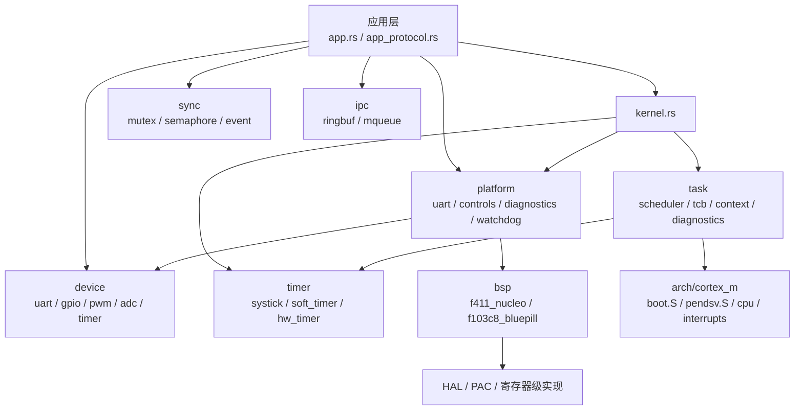
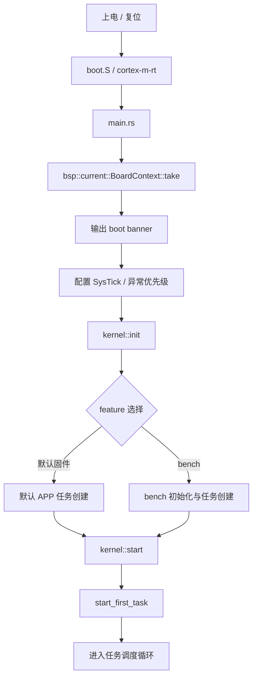
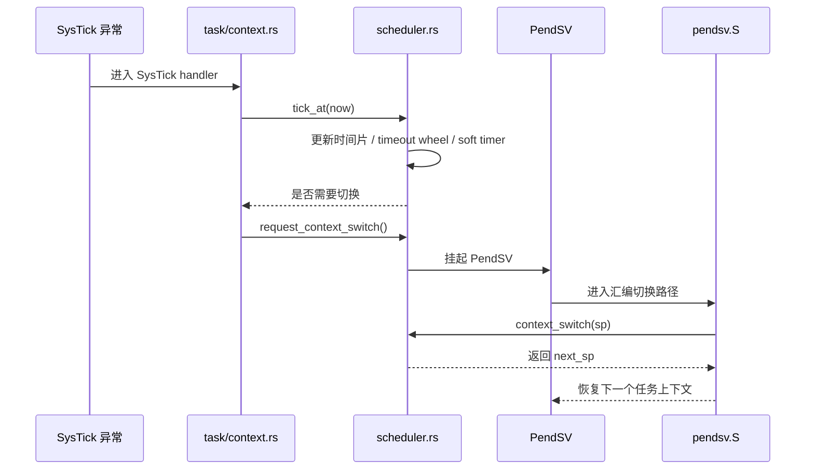
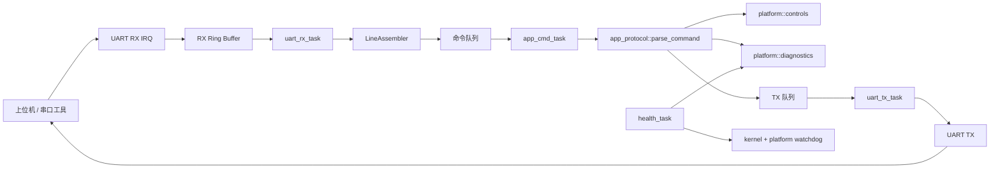
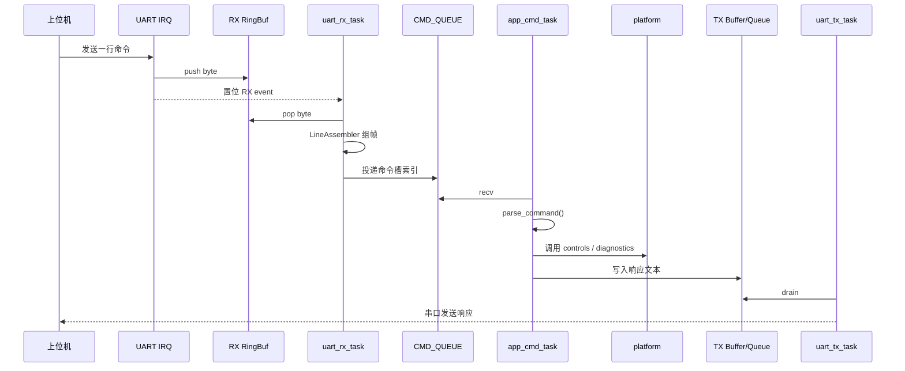
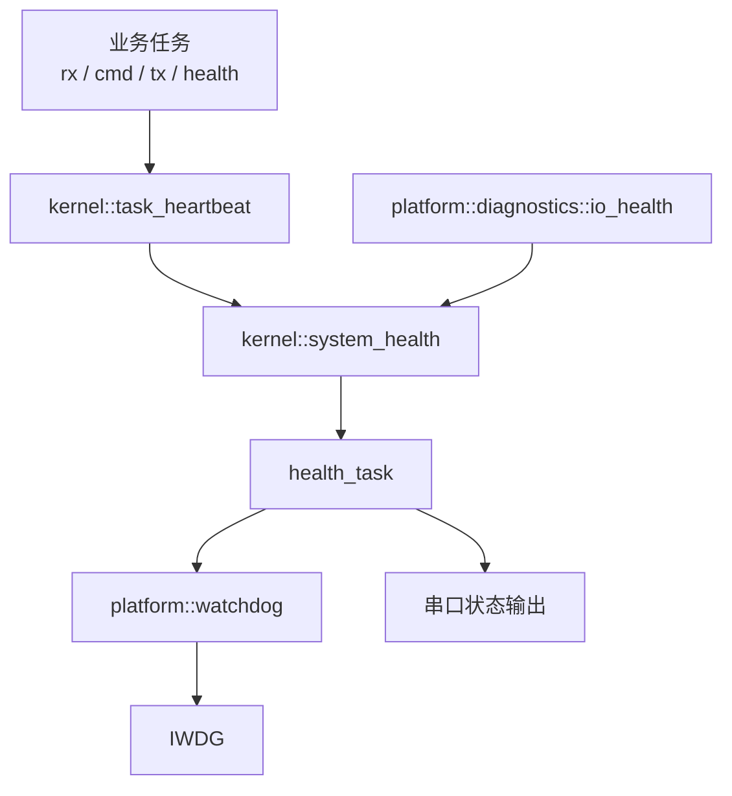
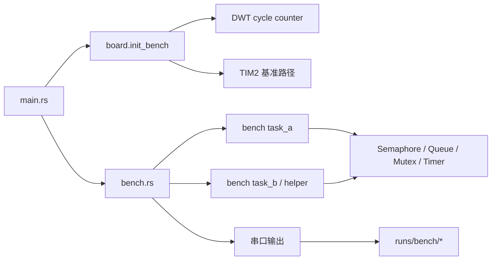
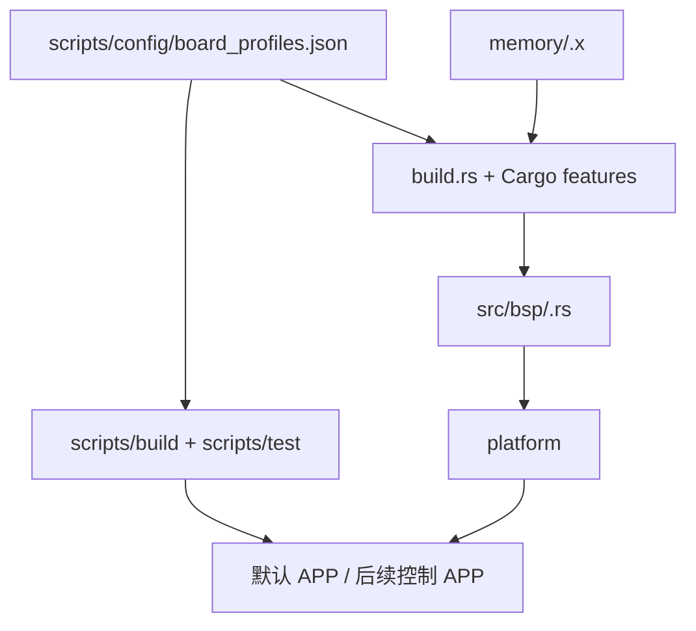

# CortexOS 模块关系图与数据流图

## 1. 文档目的

本文档用图的方式解释当前 `CortexOS` 的结构和关键运行路径，重点回答以下问题：

- 系统各层之间如何依赖
- 上电后系统如何进入任务调度
- 默认 APP 的数据如何流动
- bench 固件的测试链路如何组成
- 健康监控、诊断与看门狗如何协作
- 多板支持是如何接入到底座中的

本文档用于补充以下文档：

- `README.md`
- `docs/dev/RTOS_TECHNICAL_STATUS.md`
- `docs/release/DEVELOPER_GUIDE.md`

它不展开所有代码实现细节，而是强调“结构关系”和“数据流向”。

---

## 2. 总体模块关系图

### 说明

- `app` 是默认业务入口。
- `platform` 是应用看到的统一门面。
- `device` 是更基础的设备包装层。
- `kernel` 是面向应用的内核 API 门面。
- `task/timer/sync/ipc` 是 RTOS 核心能力层。
- `bsp` 负责把具体板资源映射到底座。
- `arch/cortex_m` 负责最低层启动与上下文切换。

正确工程方向是：应用向上依赖门面，板差异向下封装在 `bsp`。

---

## 3. 启动与执行流程图

### 说明

- `BoardContext::take()` 负责接管具体板资源。
- `main.rs` 负责把板初始化、日志、系统时基和 feature 路径串起来。
- `kernel::init()` 初始化调度器和软定时器。
- `kernel::start()` 进入首任务，之后系统进入任务驱动模式。

---

## 4. 节拍推进与上下文切换图

### 说明

- `SysTick` 负责推进系统时间、软定时器和时间片。
- 调度器只决定“接下来谁运行”。
- 真正的寄存器现场保存/恢复在 `PendSV` 汇编里完成。

这条链路是 RTOS 最关键的低层路径。

---

## 5. 默认 APP 总体数据流图

### 说明

默认 APP 的任务分工如下：

- `uart_rx_task`：取字节并组帧
- `app_cmd_task`：解析命令并执行业务逻辑
- `uart_tx_task`：统一发送响应
- `health_task`：健康状态、诊断打印、看门狗协调

设计原则是：中断最小化，复杂逻辑下沉到任务上下文。

---

## 6. 默认 APP 命令时序图

### 说明

- 协议为 ASCII 行协议，`\r\n` 结尾。
- `LineAssembler` 负责逐字节组帧。
- 在 `F103` 路径上，如果检测到 UART 硬件错误，当前策略是丢弃整行，避免脏字节进入命令解析链路。

---

## 7. 健康监控与看门狗链路图

### 说明

- 各任务通过心跳接口上报活性。
- `kernel::system_health()` 汇总任务状态、UART 统计、栈水位和 trace 信息。
- `health_task` 负责周期输出和看门狗协调。

这条链路的目标是支持默认 APP 的长稳运行。

---

## 8. bench 固件链路图

### 说明

- bench 通过专门任务和同步对象构造性能测试场景。
- 借助 DWT 记录周期数，再通过串口输出采样结果。
- PC 侧脚本将结果整理成 `CSV` 和汇总报告。

bench 与默认 APP 是两条平行的运行形态。

---

## 9. 多板支持接入图

### 说明

新板标准接入路径是：

1. 在 `board_profiles.json` 中登记板配置
2. 增加 `memory/<board>.x`
3. 增加 `src/bsp/<board>.rs`
4. 让 `build.rs` 和 feature 选择到该板
5. 让构建/测试脚本识别该板

这也是当前多板扩展的标准工程路径。

---

## 10. 阅读建议

如果你是不同角色，建议这样看图：

### 10.1 应用开发者

重点看：

- 第 2 节总体模块图
- 第 5 节默认 APP 总体数据流图
- 第 6 节默认 APP 命令时序图

### 10.2 底座维护者

重点看：

- 第 3 节启动与执行流程图
- 第 4 节节拍推进与上下文切换图
- 第 7 节健康监控与看门狗链路图

### 10.3 多板扩展开发者

重点看：

- 第 2 节总体模块图
- 第 9 节多板支持接入图

### 10.4 后续控制样板开发者

重点看：

- 第 5 节默认 APP 数据流图
- 第 7 节健康监控链路图

因为后续雕刻机 / AGV / 机械臂样板，基本都会复用这些现有主路径。

